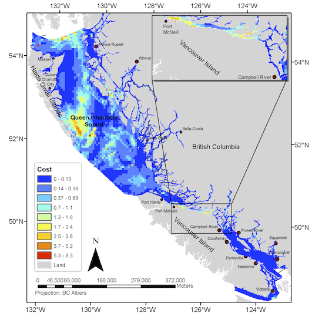
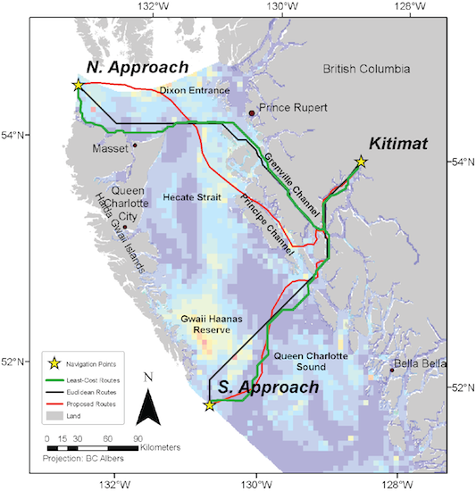
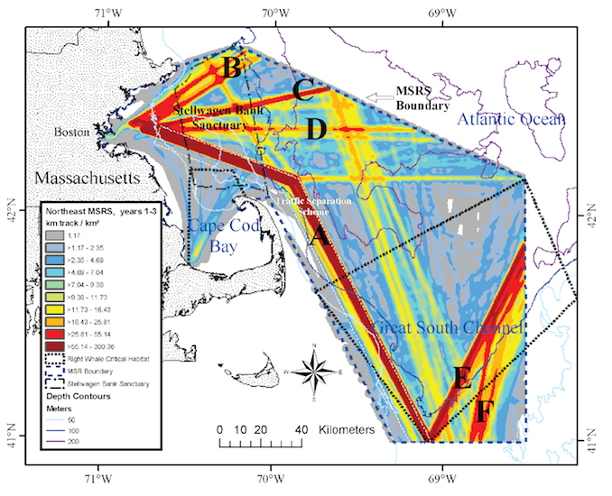

<!--- `source('make_config.R'); render_html('c_routing.Rmd') # run for quick render` -->
    ## Loading captioner

Conservation Routing
====================

Abstract
--------

Human activities such as shipping and cruising can harm endangered marine mammals through ship strike, acoustic noise and pollution. In the case of right whales in the Gulf of Maine, shipping lanes have been routed around observational hotspots of right whales. Voluntary avoidance areas have been designated elsewhere. Rerouting to date has been handled in an ad-hoc individual basis. Instead, I propose a tradeoff analysis that weights cost to industry versus risk to species. The cost to industry can be tailored to industry profiles based on extra commute distance deviating from the least cost Euclidean path. The risk to species is aggregated from species distribution models based on weights of extinction risk and sensitivities to the industry chosen profile. The final species risk surface acts as the resistance surface by which least-cost routing is implemented. Transformations are applied to this surface for providing a series of routes offering a range of tradeoffs between conservation and industry. Tradeoffs from past decisions can be mapped into this framework for providing consistent decision making elsewhere in a systematic manner. Where species distributions are available seasonally or forecast given present or future environmental conditions, routes can be dynamically generated. Realtime feedback through an interactive online application facilitates transparent decision making by industry professionals and governmental policy makers.

Introduction
------------

Vessel traffic poses the threat of ship strike, acoustic noise and spill of oil or other cargo pollutants. Reducing risk to endangered wildlife while maintaining human activities and maritime operations requires objective assessment of species habitats and human uses in both space and time. In order to better assess management options for separating endangered species and potentially harmful interactions we need to develop a synthetic, composite valuation of our marine species and then apply explicit optimization methods. Here we build a cost surface based on species distributions that are then applied to optimize the routing of vessels in the region to potentially reduce the risk of adverse interactions.

In Boston harbor where the critically endangered right whales are of concern, shipping lanes were redrawn around a simple right whale density of historical opportunistic sightings (Ward-Geiger et al. 2005). This ad-hoc method doesn’t account for variability in species distribution, observational bias or other analytical rigor for easily applying elsewhere. Methods for incorporating multiple species in such a routing analysis are untested. Studies have worked on risk of ship strike vs. cost of vessel rerouting based on a pre-defined track (Ward-Geiger et al. 2005; Vanderlaan & Taggart 2007, 2009; Fonnesbeck et al. 2008; Vanderlaan et al. 2008, 2009; Schick et al. 2009), but have yet to be suggested in a prescriptive manner.

To avoid encounters with marine mammals, hotspots of expected encounters are to be avoided, and routed around. Least-cost path algorithms, such as Djikstra’s, are commonly used in online driving directions and many other route-optimization applications. These graph-theoretic algorithms have also been playing an increasing role in routing corridors of habitat and testing connectivity of habitat patches (Chetkiewicz et al. 2006) for both terrestrial (Urban & Keitt 2001; Urban et al. 2009) and marine applications (Treml et al. 2008). The algorithm minimizes the total cost of travel between two points traversing over a resistance surface. For the sake of this conservation routing problem, the resistance surface represents the risk of species encounter.

To create this synthetic cost surface, individual species density surfaces were first relativized, and then weighted by conservation score before adding them up into a single cost surface layer. The cost surface was then used to determine alternate navigation routes for ships, which have the potential for striking animals or fouling habitat from potential spills. These methods employ least-cost path algorithms as a means to develop vessel paths that follow the most economical path through the environment while avoiding areas of high environmental risk.

In our case study area of British Columbia, an oil pipeline has been routed to Port Kittimat and oil tankers are being routed from the points of entry north and south of the Haida Gwaii islands (FIGURE XX).

While a wide variety of industries are increasingly active in the coastal waters of British Columbia, many environmental groups (PNCIMA, BCMCA, LOS) are seeking conservation-minded solutions for safely locating activities. The current ecological data layers in widest use are based on an expert feedback approach delineating important areas. Several large oil and gas projects that are currently underway are likely to increase heavy shipping into Kitimat (EnviroEmerg Consulting Services 2008), making this a useful example of the approach. One map ([Figure 1](#Figure_1)) depicts the areas in the latest draft PNCIMA Atlas, originally provided by (Clarke & Jamieson 2006). The maps in these atlases identify areas of importance as polygons. These polygon areas are then overlaid and summed to create an index of potential importance and environmental sensitivity. In the absence of observational data, this qualitative approach is the best available science. Given the availability of Raincoast surveys (Best et al. 2015), the density surfaces of each species can be combined to provide a more quantitative layer for planning purposes.

Existing routes may have preference for other factors than efficiency, such as scenic beauty or protection against inclement weather. Given that existing routes are generally preferred, a cost can be associated with movement away from these preferred routes. Here we take the case of cruise routes reported online. Euclidean distance from existing cruise route was relativized by the maximum within the study area and multiplied by the maximum cost surface value. The two surfaces can be added to obtain the final cost surface for routing, providing an example of equal weighting to conservation and routing goals.

The relative weights of these layers could be gleaned from the past precedent of re-routing shipping lanes in Boston Harbor based on overlap with a density of right whale observations. A similar spatial decision-making process could then be applied globally as thought experiment using the global shipping layer from (Halpern et al. 2008). The ability to operationally provide a framework for minimizing impacts on marine animals is especially appealing. For example, ship traffic lanes have been re-routed in Boston Harbor to reduce likelihood of striking right whales (Russell et al. 2001; Ward-Geiger et al. 2005; Fonnesbeck et al. 2008). Global data layers on human impacts in marine systems are being actively developed, including vessel traffic density (Halpern et al. 2008). Here we provide a simple framework for proposing alternative shipping routes to minimize impacts on marine animals. In this framework competing priorities, such as cost of additional travel distance and time versus risk of striking a marine mammal can be more objectively assessed.

Methods
-------

### Cumulative Risk Map

Density surface model outputs were assembled into a marine mammal composite risk map, or cost surface. Each species density surface was normalized in order to highlight areas of high density relative to its average. The unitless standard score, or z-value (\(z\)), per species (\(s\)) and pixel (\(i\)) is calculated as the pixel’s marine mammal density estimate (\(x_{i,s}\)) subtracted from the mean of all density estimates for the species (\(\mu_s\)), divided by the standard deviation of those density estimates (\(\sigma\)). The final conservation score per pixel (\(Z_i\)) represents the sum of all species scores (\(z_{i,s}\)) weighted by the extinction risk (\(w_s\)).

\[
z_{i,s} = \frac{ x_{i,s} - \mu_s }{ \sigma_s }
\] \[
Z_i = \frac{ \sum_{s=1}^{n} z_{i,s} w_s }{ n }
\]

<!---
TODO:
Is $\sigma$ per pixel or for entire DSM?
How does uncertainty play into this decision making?
--->
An inverse weighting scheme based on species extinction risk ([Figure 2](#Figure_2)) was applied to favor representation of more endangered species (Wood & Dragicevic 2007). These rankings were obtained from the Provincial listing status at British Columbia’s Endangered Species and Ecosystems website (<http://www.env.gov.bc.ca/atrisk>). Elephant seal is listed as SNA, species “not applicable”, presumably because of its semi-migratory status in BC waters. Given that its status is S4 in California and Alaska to the south and north of BC, this status was used to conform with the scheme. The values on the y-axis indicate the relativised weight used in the analysis.

### Vessel Routing

The routing will be performed with Python scripts using ESRI’s ArcGIS ArcInfo version 9.3 with the Spatial Analyst toolbox. The CostPath function was used with input cost distance and back-directional raster grids generated from the CostDistance function. The 5km original density surface grids will be resampled to a 1km resolution for use as the resistance cost surface to provide finer spatial resolution and routing within the inlets. An alternative raster grid in which all cells would be assigned a cost value of 1 serves as the Euclidean linear distance optimal spatial route providing a comparison of direct routing.

The cost surface from the composite risk map provides the biological hotspot surface around which to route. The routing was performed with Python scripts using ESRI’s ArcGIS ArcInfo version 9.3 with the Spatial Analyst toolbox. The CostPath function was used with input cost distance and back-directional raster grids generated from the CostDistance function. The 5km original density surface grids were resampled to a 1km resolution for use as the resistance cost surface to provide finer spatial resolution and routing within the inlets. An alternative raster grid in which all cells were assigned a cost value of 1 served as the Euclidean linear distance optimal spatial route providing a comparison of direct routing.

The proposed routes from Figure 10 were digitized and endpoints for north and south approaches used with the exercise to test the framework moving in and out of Kitimat. Routes between all navigation points, originally including other ports (Prince Rupert and Port Hardy), were also calculated. Existing routes may have preference for other factors than efficiency, such as scenic beauty or protection against inclement weather. Given that existing routes are generally preferred, a cost can be associated with movement away from these preferred routes. Here we take the case of cruise routes reported online . Euclidean distance from existing cruise route was relativized by the maximum within the study area and multiplied by the maximum cost surface value. The two surfaces were added to obtain the final cost surface for routing, providing an example of equal weighting to conservation and routing goals.

Results
-------

The composite risk map for all marine mammals (Figure 12) is very similarly distributed as just the large whales (Figure 13) composed of killer, humpback, fin and minke whale. Consistent with (Clarke & Jamieson 2006), Hecate Strait was found to be relatively important, along with the Dixon entrance. The highest value hotspot is in Gwaii Hanas Reserve, already under some level of protection. The high levels in stratum 3 Johnstone Strait (see zoom view) may be an anomaly of the environmental conditions there, since few sightings were made by comparison.

The routes do differ markedly (Figure 14). It is not clear whether Grenville Channel is deep and wide enough to support the kind of tanker traffic envisioned. Besides being closer to the northern approach, as evidenced by that inlet choice with the Euclidean path, Grenville Channel exhibits a lower level of potential marine mammal interaction as predicted by the composite marine mammal densities than through the Principe Channel as proposed. By routing through the Grenville Channel the potential interactions in the Hecate Strait could also be avoided. The proposed Southern approach exhibits relatively lower potential interactions with the least-cost route even dipping south around the Gwaii Haanas Reserve.

The existing ship routes pass through both the Principe and Grenville Channels. Models developed to conduct least-cost path analysis use raster grid cells. For modeling purposes these cells provide eight possible directions at each step (i.e. 4 side and 4 diagonal directions). These models create uneven turns when compared to the smoother Euclidean route or with the proposed routes (Figure 15). Although the Euclidean path should be the shortest, the existing industry route up the Principe Channel is the shortest ([Table 1](#Table_1)).

Tables
------

| Route                                                    | Euclidean | Industry | Least-Cost |
|----------------------------------------------------------|-----------|----------|------------|
| Kitimat to N. Approach (Conservation)                    | 391       | 410      | 425        |
| Kitimat to S. Approach (Conservation)                    | 304       | 319      | 336        |
| S. to N. Cruise Route (Conservation + Distance to Route) | 470       | 450      | 504        |

Figures
-------

Notes
-----

TODO: - add figure: tradeoff points + route map, color coded - optimal least-cost on outside - less optimal, linearized for IMO shipping lane standards - handle speed reductions in given areas (see Schick 2008; Vanderwaal), which accumulate lower risk - compliance: Vanderwaal, elsewhere - industry routing: weather, other considerations? - TIME: - show routes over time with same decision point - APP: - do real time routing - feedback from Raincoast, Mersk, Shaun on actual application. How could this relate to insurance incentivizing program? - research issues with SB Channel in trying to get rerouting accomplished

References
----------

Best, B. D., C. H. Fox, R. Williams, P. N. Halpin, and P. C. PAQUET. 2015. Updated marine mammal distribution and abundance estimates in coastal british columbia. Journal of Cetacean Research and Management.

Chetkiewicz, C. L. B., C. C. S. Clair, and M. S. Boyce. 2006. Corridors for conservation: Integrating pattern and process.

Clarke, C. L., and G. S. Jamieson. 2006. Identification of ecologically and biologically significant areas in the pacific north coast integrated management area: Phase iIdentification of important areas. Canadian Technical Report of Fisheries and Aquatic Sciences **2678**:59. Available from <http://smtp.pncima.org/media/documents/pdf/phase-2-id.pdf> (accessed June 22, 2015).

EnviroEmerg Consulting Services. 2008. Major marine vessel casualty risk and response preparedness in british columbia. Cowichan Bay, BC Canada.

Fonnesbeck, C. J., L. P. Garrison, L. I. Ward-Geiger, and R. D. Baumstark. 2008. Bayesian hierarchichal model for evaluating the risk of vessel strikes on north atlantic right whales in the SE united states. Endangered Species Research.

Halpern, B. S. et al. 2008. A global map of human impact on marine ecosystems. Science **319**:948–952. Available from <http://www.sciencemag.org/cgi/content/abstract/319/5865/948> (accessed March 30, 2008).

Russell, B. A., A. R. Knowlton, and B. Zoodsma. 2001. Recommended measures to reduce ship strikes of north atlantic right whales. National Marine Fisheries Service.

Schick, R. S. et al. 2009. Striking the right balance in right whale conservation. Canadian Journal of Fisheries and Aquatic Sciences **66**:1399–1403. Available from <http://darchive.mblwhoilibrary.org:8080/handle/1912/3164> (accessed March 29, 2010).

Treml, E. A., P. N. Halpin, D. L. Urban, and L. F. Pratson. 2008. Modeling population connectivity by ocean currents, a graph-theoretic approach for marine conservation. Landscape Ecology **23**:19–36.

Urban, D. L., E. S. Minor, E. A. Treml, and R. S. Schick. 2009. Graph models of habitat mosaics. Ecology Letters **12**:260–273. Available from <http://dx.doi.org/10.1111/j.1461-0248.2008.01271.x> (accessed March 19, 2010).

Urban, D., and T. Keitt. 2001. Landscape connectivity: A graph-theoretic perspective. Ecology **82**:1205–1218. Available from [http://www.esajournals.org/doi/abs/10.1890/0012-9658(2001)082[1205:LCAGTP]2.0.CO;2](http://www.esajournals.org/doi/abs/10.1890/0012-9658(2001)082[1205:LCAGTP]2.0.CO;2) (accessed December 17, 2014).

Vanderlaan, A. S., and C. T. Taggart. 2007. Vessel collisions with whales: The probability of lethal injury based on vessel speed. Marine mammal science **23**:144–156.

Vanderlaan, A. S., and C. T. Taggart. 2009. Efficacy of a voluntary area to be avoided to reduce risk of lethal vessel strikes to endangered whales. Conservation Biology **23**:1467–1474.

Vanderlaan, A. S., C. T. Taggart, A. R. Serdynska, R. D. Kenney, and M. W. Brown. 2008. Reducing the risk of lethal encounters: Vessels and right whales in the bay of fundy and on the scotian shelf. Endangered Species Research **4**:283.

Vanderlaan, A., J. Corbett, S. Green, J. Callahan, C. Wang, R. Kenney, C. Taggart, and J. Firestone. 2009. Probability and mitigation of vessel encounters with north atlantic right whales. Endangered Species Research **6**:273–285. Available from <http://www.int-res.com/abstracts/esr/v6/n3/p273-285/> (accessed June 11, 2015).

Ward-Geiger, L. I., G. K. Silber, R. D. Baumstark, and T. L. Pulfer. 2005. Characterization of ship traffic in right whale critical habitat. Coastal Management **33**:263–278.

Wood, L., and S. Dragicevic. 2007. GIS-based multicriteria evaluation and fuzzy sets to identify priority sites for marine protection. Biodiversity and Conservation **16**:2539–2558. Available from <http://dx.doi.org/10.1007/s10531-006-9035-8> (accessed February 17, 2009).
